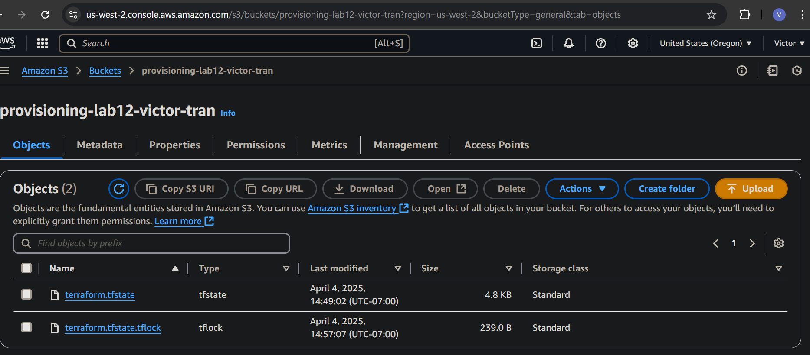
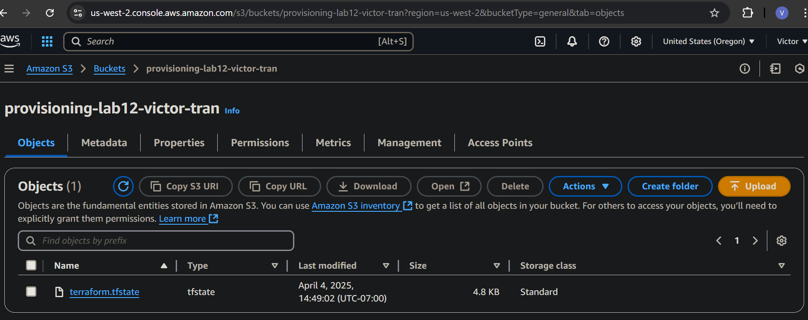

# provisioning-lab-week13

## Screenshots

**lock-file.png**

**state-file.png**

## Questions

**When is the state file created?**

After the first terraform apply

**When is the lock file present?**

When terraform resources are being modified

**Is the lock file always in the bucket after it is created?**

No
